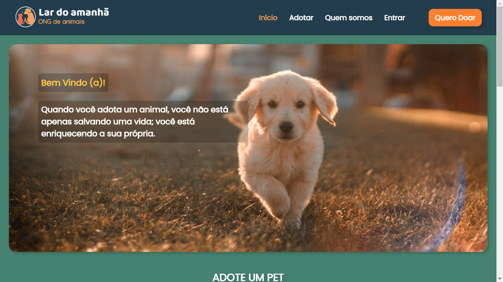

#  Lar do amanhã 🐶
O Lar do amanhã é um site que foi desenvolvido com intuito de facilitar a doação de animais e à promoção da adoção responsável de animais de estimação. Nosso objetivo é criar uma comunidade amorosa que conecte pessoas dispostas a doar animais a indivíduos em busca de um novo amigo peludo para compartilhar suas vidas.

 [▶️Clique aqui](https://gabriel-augg.github.io/lar-do-amanha/) para testar o projeto.

## Recursos principais

**Cadastro de Usuário:**

Os visitantes podem criar uma conta pessoal para acessar todas as funcionalidades do site.

**Doação de Animais:**

- Os usuários registrados têm a opção de criar perfis para animais que desejam doar.
Eles podem fornecer informações detalhadas sobre o animal, foto, nome, raça e descrição.
É possível atualizar ou remover os perfis dos animais a qualquer momento.

**Adoção de Animais:**

- Qualquer pessoa pode navegar pelos perfis de animais disponíveis para adoção sem a necessidade de cadastro.
Os interessados em adotar podem entrar em contato com os doadores através do site ou pelo whatsapp.

**Pesquisa e Filtros:**

- Os usuários podem usar filtros de pesquisa avançados para encontrar animais que atendam às suas preferências, como raça, localização e idade.

## Tecnologias utilizadas 💻

- HTML
- CSS
- JavaScript
- Sass
- localStorage
